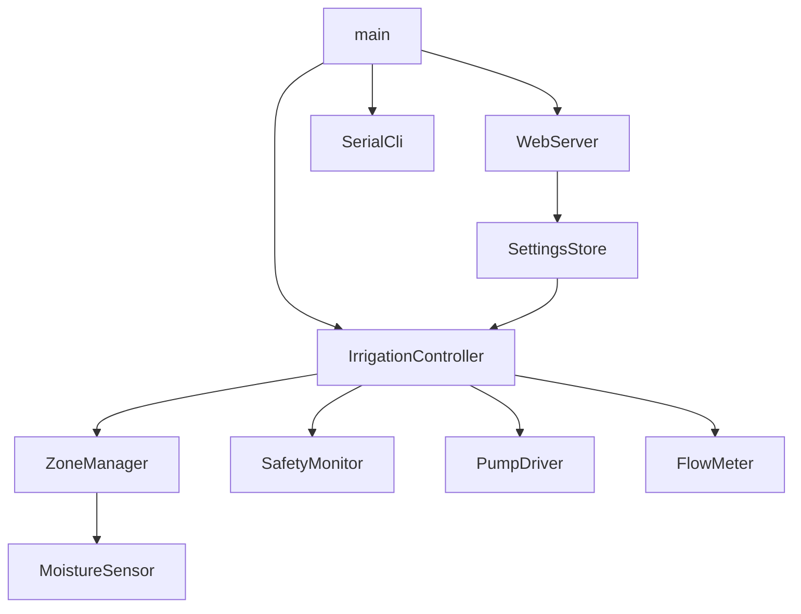

# 开发文档

> 版本：2.1 | 最后更新：2026-08-01

## 1. 开发环境

| 工具 | 版本要求 |
|------|----------|
| [PlatformIO](https://platformio.org/) | Core 6+ |
| VS Code + PlatformIO 扩展 | 推荐 |
| Python | 3.8+（PlatformIO 依赖） |

### 1.1 克隆与打开

```bash
git clone git@github.com:typhoon322/AutoWateringSystem.git
cd AutoWateringSystem   # 克隆后的目录名；本机若已重命名则 cd 到实际路径

# 本机开发路径（原 Untitled 已重命名为 AutoIrrigationSystem）：
# ~/ESP32/AutoIrrigationSystem/AutoIrrigationSystem
cd ~/ESP32/AutoIrrigationSystem/AutoIrrigationSystem

pio run -e esp32-s3-irrigation
```

### 1.2 编译 / 烧录 / 监控

```bash
pio run -e esp32-s3-irrigation
pio run -e esp32-s3-irrigation -t upload
pio device monitor -b 115200
pio run -e esp32-s3-irrigation -t uploadfs
```

### 1.3 编译环境

| PlatformIO env | MCU | 用途 |
|----------------|-----|------|
| `esp32-s3-irrigation` | ESP32-S3 | 唯一目标（I2C GPIO8/9，0.96" 状态屏，流量计与阀开启） |

---

## 2. 目录结构

```
.
├── platformio.ini
├── include/
│   ├── config.h                 # 全局默认参数
│   ├── boards/
│   │   ├── board_io_map.h       # I2C 扩展板布局（10 路）
│   │   └── board_s3.h           # ESP32-S3 引脚
│   └── types/
│       └── zone_config.h        # 分区与系统配置结构体
├── src/
│   ├── main.cpp
│   ├── sensor/
│   │   ├── ads1115.h/cpp
│   │   ├── moisture_sensor.h/cpp
│   │   └── flow_meter.h/cpp
│   ├── actuator/
│   │   ├── pca9555.h/cpp
│   │   ├── pump_driver.h/cpp
│   │   └── valve_driver.h/cpp
│   ├── bus/
│   │   └── i2c_bus.h/cpp
│   ├── control/
│   │   ├── zone_manager.h/cpp
│   │   └── irrigation_controller.h/cpp
│   ├── safety/
│   │   └── safety_monitor.h/cpp
│   ├── storage/
│   │   └── settings_store.h/cpp
│   ├── web/
│   │   └── web_server.h/cpp
│   ├── cli/
│   │   └── serial_cli.h/cpp
│   └── ota/
│       └── firmware_ota.h/cpp
├── data/                        # LittleFS（可选扩展）
└── docs/
    ├── system-design.md
    ├── development.md           # 本文件
    ├── user-manual.md
    ├── wiring.md
    ├── bom.md
    └── DOC_MAP.md
```

### 2.1 模块依赖



---

## 3. 配置项

### 3.1 编译期常量（`include/config.h`）

| 宏 | 默认 | 说明 |
|----|------|------|
| `MAX_ZONES` | 10 | 最大分区数 |
| `ACTIVE_ZONES` | 2 | 初版激活分区 |
| `DEFAULT_MOISTURE_LOW` | 30 | 湿度下限 % |
| `DEFAULT_MOISTURE_HIGH` | 60 | 湿度上限 % |
| `DEFAULT_VOLUME_ML` | 100 | 单次体积 mL |
| `DEFAULT_MAX_RUN_SEC` | 60 | 最长泵运行 s |
| `DEFAULT_DAILY_LIMIT_ML` | 2000 | 日限额 mL |
| `DEFAULT_PULSES_PER_LITER` | 450 | YF-S201 典型值 |
| `DEFAULT_DRY_RUN_SEC` | 3 | 干转判定 s |
| `SAMPLE_INTERVAL_MS` | 5000 | 湿度采样周期 |
| `STATUS_PRINT_INTERVAL_MS` | 1000 | 状态行周期 |
| `RADIO_WIFI_DEFAULT_ENABLED` | 1 | WiFi 默认开（混合 AP+STA） |
| `WIFI_SSID` / `WIFI_PASS` | OneMore / onemore.2025 | 编译内置，NVS 可覆盖 |
| `WIFI_HYBRID_MODE` | 1 | AP+STA 同时运行 |

### 3.2 NVS 键名（namespace: `irrigation`）

| Key | 类型 | 说明 |
|-----|------|------|
| `magic` | uint32 | 0x49525247 |
| `maxRun` | uint16 | max_run_sec |
| `dailyLim` | uint32 | daily_limit_ml |
| `ppl` | uint16 | pulses_per_liter |
| `dryRun` | uint8 | dry_run_sec |
| `zCnt` | uint8 | zone_count |
| `zN{i}` | string | zone name, i=0..9 |
| `zML{i}` | uint8 | moisture_low |
| `zMH{i}` | uint8 | moisture_high |
| `zVol{i}` | uint16 | volume_ml |
| `zAuto{i}` | uint8 | auto_enabled |
| `zSchE{i}` | uint8 | schedule_enabled |
| `zSchH{i}` | uint8 | schedule_hour |
| `zSchM{i}` | uint8 | schedule_minute |
| `zDry{i}` | uint16 | cal_dry adc |
| `zWet{i}` | uint16 | cal_wet adc |
| `wifiEn` | uint8 | WiFi enabled |
| `wifiSSID` | string | SSID |
| `wifiPass` | string | password |

---

## 4. 串口 CLI

- 波特率：**115200**
- 行结束：`\n`

### 4.1 命令列表

| 命令 | 说明 |
|------|------|
| `help` | 显示命令列表 |
| `status` | 全局与各分区状态 |
| `zone <n> status` | 指定分区详情 |
| `water <zone> <ml>` | 手动浇水 |
| `stop` | 停泵并清除故障锁定 |
| `auto on\|off [zone]` | 启用/禁用阈值模式 |
| `set low <zone> <pct>` | 设置湿度下限 |
| `set high <zone> <pct>` | 设置湿度上限 |
| `set vol <zone> <ml>` | 设置单次体积 |
| `set schedule <zone> <HH:MM>` | 设置定时 |
| `schedule <zone> on\|off` | 开关定时模式 |
| `cal dry <zone>` | 当前 ADC 存为干土点 |
| `cal wet <zone>` | 当前 ADC 存为湿土点 |
| `flow` | 显示脉冲计数与体积 |
| `pump on\|off` | 调试：直接开关泵（绕过控制器） |
| `valve <z>\|off` | 调试：打开指定阀或全部关闭 |
| `set zones <n>` | 激活分区数 1–10（单盆用 1） |
| `ppl <n>` | 设置 pulses_per_liter |
| `wifi ssid <name>` | 设置 WiFi SSID |
| `wifi pass <pass>` | 设置 WiFi 密码 |
| `wifi on\|off` | 开关 WiFi |
| `save` | 保存当前配置到 NVS |

### 4.2 周期状态行

约每秒输出：

```
[status] pump=OFF valve=OFF state=IDLE safety=OK daily=0ml queue=0 Z0=45% ...
```

| 字段 | 含义 |
|------|------|
| `pump` | ON / OFF |
| `valve` | OFF 或 Zn（当前打开的阀） |
| `state` | IDLE / CHECKING / VALVING / PUMPING / DONE / FAULT |
| `safety` | OK / TIMEOUT / DRY_RUN / DAILY_LIMIT / LOCKED |
| `daily` | 今日累计 mL |
| `Z{n}` | 分区湿度 % |
| `queue` | 等待队列长度 |

---

## 5. Web API

Base URL: `http://<device-ip>/`

Dashboard（`/`）内嵌联调测试能力（2026-08-18 增强）：
- 实时状态含：编译特性（阀/流量计/最大阀数）、安全参数生效值、各盆传感器有效性
- I2C 设备列表与流量计读数自动刷新（2s），无需手动点击
- 测试控制台含：泵运行计时、ppl 标定计算器（量杯体积+脉冲 → 写入）、安全功能测试引导（干转/超时/日限额，须走"队列浇水"流程触发）、联调步骤引导（6 步勾选，localStorage 保存）

### 双页面结构（2026-08-22）

- `/` 家庭首页：湿度卡片、一键浇水、自动模式开关、故障恢复、最近浇水记录、自动时段展示（家人用）
- `/dev` 调试页：测试控制台/参数/标定/I2C/流量/步骤引导（开发联调用）
- `GET /api/history`：最近 50 条浇水记录（NVS 持久化，重启保留）`{records:[{ts,zone,volume_ml,trigger}]}`，trigger: manual|threshold|schedule
- 浇水时间窗口：`auto_window_enabled` + `auto_win_sh/sm/eh/em`（全局），每盆 `window_override` + `win_sh/sm/eh/em`（覆盖）；窗口外自动（阈值）不触发，手动/定时不受限；支持跨午夜

### 显示屏与面板按键（2026-10-02，S3）

- 0.96" SSD1306 128×64，I2C 四针，地址 0x3C，SDA/SCL 与扩展板共用 **GPIO8/9**，供电 3.3V
- 动作键 GPIO6、急停键 GPIO7：自复开关，一端接 GPIO、一端接 GND（内部上拉，按下为低）
- 短按动作键（<0.8 s）：立即采样，湿度低于下限的已标定盆按各自 `volume_ml` 排队浇水
- 长按动作键（≥0.8 s）：全部盆在自动/手动之间切换，并写入 NVS
- 急停键：按下即 `emergencyStop`（停泵关阀并锁定）
- 屏上一次 4 盆：`1# 偏干 28% 自动`。超过 4 盆时每 10 秒翻一页
- 有动作时整屏改为当前动作，例如 `1# 正在浇水作业`（开阀和浇水都用这句）；按键说明约 4 秒
- 屏若装反，构造使用 `U8G2_R2`（旋转 180°）
- 旧的 SH1106 + EC11 + LVGL 三屏仍留在代码里，`BOARD_HAS_LVGL=0`，当前不编译

### 显示屏（2026-08-22 接入，v2：SH1106 128×64 I2C，已由上节取代）

- SH1106 128×64 OLED，I2C 共用 GPIO8/9（地址 0x3C），LVGL 9 单色（LV_COLOR_DEPTH=1）
- EC11 编码器（TRIM_A/B→GPIO6/7）+ 按键（KEY0=返回→GPIO17、KEY1=确认→GPIO16；PUSH 预留）
- 3 屏：主界面（泵/今日水量 + 盆列表）、盆详情（浇水）、故障页（恢复）
- 中文字库：`src/ui/lv_font_cn_14.c`（Noto Sans SC 14px 1bpp 子集）
- 引脚集中 `include/boards/board_s3.h`（OLED_I2C_ADDR/编码器/按键宏），线序按实际模块调整该处
- 水量=该盆配置 volume_ml；旋钮调水量为后续迭代

### 开机自检（2026-08-22）

- 上电自检：I2C 设备清单（PCA9555/ADS1115×3/屏幕 0x3C），缺失项警告不阻断
- 自检期间 Web 写 API 与 CLI 写命令返回"自检中"；只读与急停豁免
- 屏幕显示自检摘要（有警告红字停留 3s）；Web `/api/status.selfcheck` 暴露结果，家庭首页显示警告

### 5.1 GET /api/status

```json
{
  "board": "ESP32-S3-Irrigation",
  "pump": false,
  "valve_on": false,
  "active_valve": -1,
  "state": "IDLE",
  "safety": "OK",
  "daily_ml": 120,
  "active_zone": -1,
  "queue": 0,
  "wifi": { "connected": true, "ip": "192.168.1.100", "rssi": -55 },
  "zones": [
    {
      "id": 0,
      "name": "Zone0",
      "moisture_pct": 45,
      "moisture_adc": 2100,
      "auto_enabled": true,
      "schedule_enabled": false,
      "moisture_low": 30,
      "moisture_high": 60,
      "volume_ml": 100
    }
  ]
}
```

### 5.2 GET /api/settings

返回完整 `SystemConfig` + `ZoneConfig[]` JSON。

### 5.3 POST /api/settings

Body 为部分或全部配置字段，保存到 NVS。

### 5.4 POST /api/irrigate

```json
{ "zone": 0, "volume_ml": 150 }
```

### 5.5 POST /api/stop

无 body，停泵、关阀、清除故障（同 CLI `stop`）。

### 5.6 POST /api/test/pump

```json
{ "on": true }
```

调试：直接开关水泵（绕过控制器）。

### 5.7 POST /api/test/valve

```json
{ "zone": 0 }
```

打开指定阀；`{ "zone": -1 }` 或省略关闭所有阀。

### 5.8 POST /api/cal

```json
{ "zone": 0, "point": "dry" }
```

`point`: `dry` | `wet`，将当前 ADC 写入校准并保存 NVS。

### 5.9 GET /api/flow

```json
{ "pulses": 120, "volume_ml": 45, "pulses_per_liter": 450 }
```

### 5.10 POST /api/flow/reset

无 body，清零当前会话流量计脉冲（同调试用途）。

### 5.11 POST /api/sample

无 body，立即采样所有分区湿度（不等 5 s 周期）。

### 5.12 GET /api/i2cscan

```json
{ "sda": 5, "scl": 6, "devices": [32, 60, 72] }
```

地址为十进制（0x20=32, 0x3C=60, 0x48=72）。

### 5.13 POST /api/auto

```json
{ "zone": 0, "enabled": true }
```

或 `{ "all": true, "enabled": false }` — 开关阈值自动模式并保存 NVS。

### 5.14 POST /api/settings（完整）

Body 可含 `zones[]` 每分区：`name`, `moisture_low/high`, `volume_ml`, `auto_enabled`, `schedule_enabled`, `schedule_hour/minute`, `cal_dry/wet`。Web UI 通过此接口保存全部参数。

### 5.15 POST /api/emergency-stop

无 body，立即停泵。

### 5.16 GET/POST /api/wifi

GET 返回连接状态；POST 设置 `ssid`, `password`, `enabled`。

## 5.17 BLE（安卓 App）

广播名 **Langua**。服务 `8a1f0001-4b2c-4d5e-9f10-112233445501`。

| 特征 | UUID 尾 | 方向 | 内容 |
|------|---------|------|------|
| 状态 | …5502 | Notify | `A5` + 包序号 + 总包数 + 载荷切片（每片 17 字节） |
| 命令 | …5503 | Write | ASCII：`water <z> <ml>`、`auto <z> 0\|1`、`vol <z> <ml>`、`th <z> <low> <high>`、`estop`、`stop`、`sample`、`pump 0\|1`、`valve <z>\|off`、`cal <z> dry\|wet` |
| 应答 | …5504 | Notify | `OK` 或 `ERR ...` |

状态载荷（小端）：版本、运行状态、安全状态、标志（泵/阀/锁定）、当前阀、队列、盆数、今日 ml、本次 ml；每盆 16 字节（湿度%、上下限、自动/有效标志、水量、ADC、名称最多 7 字节）。

安卓工程在 `android/`。打开 App 时自动搜索并连接一次。浇水、自动、急停、标定干/湿、泵阀单控都在 App 里。配网仍用网页。

---

## 6. 标定流程

### 6.1 流量计标定

1. 准备量杯（已知体积，如 500 mL）
2. `pump on` 或 `water 0 9999` 让水流通
3. 记录 CLI `flow` 显示的脉冲数 `P`
4. `ppl = P * 1000 / volume_ml`
5. `ppl <value>` 写入，`save`

默认 YF-S201：**450** pulse/L（1 L ≈ 450 脉冲）。

### 6.2 湿度传感器标定

1. 探头置于 **完全干燥** 盆土 → `cal dry 0`
2. 充分浇透后 → `cal wet 0`
3. `save`
4. 对 Zone 1 重复：`cal dry 1` / `cal wet 1`

未校准时使用默认 ADC：干 3200 / 湿 1400（12-bit）。

### 6.3 各盆浇水量标定（支管长度不同时）

单流量计在泵后时，计数包含该路 **阀 → 盆** 管段内的水。支管越长，同样 `volume_ml` 进土越少。

**标定步骤（每盆重复）：**

1. 确认 `ppl` 已用 §6.1 标定；管路已排气
2. 该盆：`water <zone> 300`（用大值试浇）
3. 用量杯测 **实际进盆土** V_actual（mL）
4. 目标进土 V_target（如 100 mL）→ 设定值  
   `volume_ml = V_target × 300 / V_actual`
5. Web 或 `set vol <zone> <ml>`，`save`
6. 再浇 2–3 次微调 ±10 mL

**施工建议：**

- 流量计：泵后、分水器前，前后直管 15–20 cm
- 每路阀后加止回阀
- 分水器靠近流量计

---

## 7. 测试清单

### 7.1 单元 / 逻辑（无硬件）

- [ ] 编译通过 `pio run -e esp32-s3-irrigation`
- [ ] 状态机：模拟体积达标后转 Done
- [ ] 日限额：累计超限后拒绝 auto

### 7.2 硬件联调

| 步骤 | 操作 | 预期 |
|------|------|------|
| 1 | 上电，串口 monitor | 打印 Board 名与版本 |
| 2 | `status` | 显示 Z0/Z1 湿度 |
| 3 | `pump on` 1 秒 | 继电器吸合，**立即** `pump off` |
| 4 | 通水，`water 0 50` | 约 50 mL 后自动停泵 |
| 5 | 干转测试（无水） | 3 s 内报 DRY_RUN |
| 6 | WiFi `wifi on`，连接 AP | Web 可访问 |
| 7 | Web 手动浇水 | 与 CLI 行为一致 |
| 8 | 断电重启 | 配置保留 |

### 7.3 Wokwi 仿真（v1.1 计划）

- 用电位器模拟 ADC 湿度
- LED 模拟泵输出
- 按钮模拟脉冲输入

---

## 8. 文档同步

修改代码时对照 [DOC_MAP.md](DOC_MAP.md) 更新对应文档。Cursor 规则见 [`.cursor/rules/documentation-sync.mdc`](../.cursor/rules/documentation-sync.mdc)。

---

## 9. 默认参数汇总

| 参数 | 值 |
|------|-----|
| 湿度下限 / 上限 | 30% / 60% |
| 单次体积 | 100 mL |
| 最长泵运行 | 60 s |
| 日限额 | 2000 mL |
| pulses_per_liter | 450 |
| 干转判定 | 3 s |
| 采样间隔 | 5 s |
