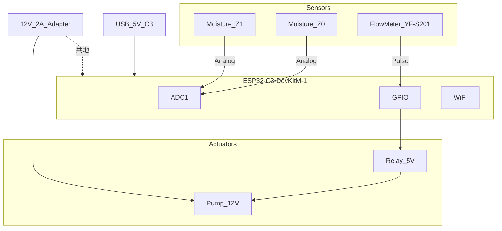
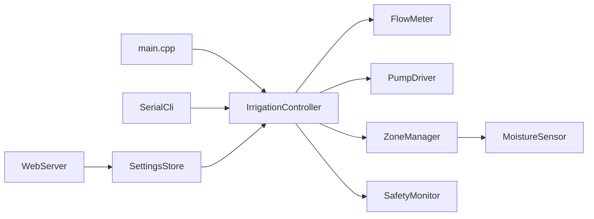
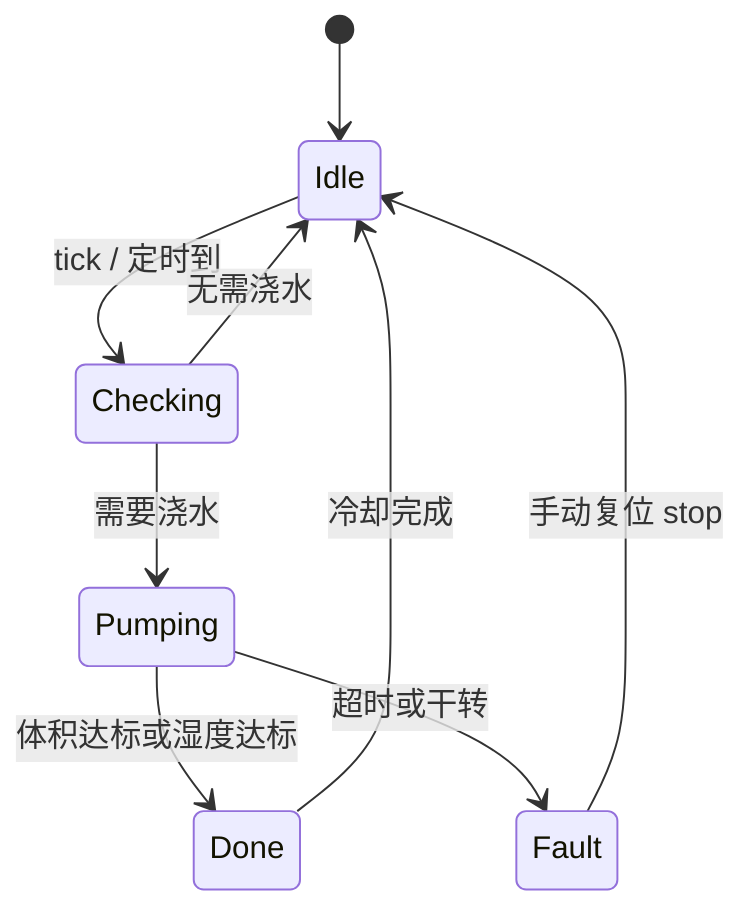

# 系统设计文档 — ESP32-C3 多路自动浇花系统

> 版本：1.0 | 最后更新：2026-08-01

## 1. 项目背景与目标

家用多盆植物需要定时、定量补水。纯湿度阈值控制难以保证每次浇水量一致；加入流量计后可实现 **mL 级定量浇水**，避免过浇或欠浇。

本系统基于 **ESP32-C3-DevKitM-1**，支持 **2 个灌溉分区**（可扩展至 4 路），通过 **WiFi + 本地 Web 界面** 监控与配置，离线亦可独立运行（串口 CLI + 板载 RGB LED 状态指示）。

### 1.1 设计目标

| 目标 | 指标 |
|------|------|
| 定量精度 | ±5%（标定后，YF-S201 典型值 450 pulse/L） |
| 分区数 | 初版 2 路，架构预留 4 路 |
| 联网 | 局域网 Web UI，WiFi 默认关闭 |
| 安全 | 超时停泵、干转检测、日累计上限 |
| 可维护 | 模块化固件 + 文档与代码映射（见 [DOC_MAP.md](DOC_MAP.md)） |

---

## 2. 需求规格

### 2.1 功能需求

| ID | 功能 | 说明 |
|----|------|------|
| F1 | 土壤湿度采集 | 电容式传感器，ADC 读取，支持干/湿两点校准 |
| F2 | 阈值自动浇水 | 湿度 < 下限时启动，达到上限或目标体积后停止 |
| F3 | 定时定量浇水 | 按 HH:MM 调度，每次固定 mL |
| F4 | 手动浇水 | Web / CLI 指定分区与体积 |
| F5 | 流量计闭环 | 脉冲计数换算体积，达到目标停泵 |
| F6 | 多分区顺序灌溉 | 单泵，同一时刻仅一个分区浇水，其余排队 |
| F7 | Web 监控 | 实时湿度、泵状态、今日流量、配置 |
| F8 | 串口 CLI | 115200 baud，调试与标定 |
| F9 | OTA | 局域网 Web 固件升级（可选密码） |
| F10 | NVS 持久化 | 阈值、体积、WiFi、标定系数掉电保存 |

### 2.2 非功能需求

- **响应**：湿度采样周期 5 s，Web 状态刷新 2 s
- **可靠性**：泵最大单次运行 60 s（可配置）；干转 3 s 无脉冲则锁定
- **扩展**：v2 可增电磁阀实现独立水路；v3 可增 MQTT / OLED

---

## 3. 硬件架构

### 3.1 系统框图



### 3.2 多路灌溉策略

**初版：单泵 + 顺序灌溉**

- 1 个 12 V 水泵 + 1 个继电器 + 1 个流量计
- 2 个湿度探头分别对应 Zone 0 / Zone 1
- 浇水时将出水口对准目标花盆，或依靠后续电磁阀扩展

**扩展（v2）：单泵 + 电磁阀**

- 每个分区增加一路 5 V 电磁阀
- 浇水前打开对应阀，流量计仍共用

### 3.3 引脚分配

ESP32-C3 模组 **GPIO11–17 接 Flash，不可用**。

| 功能 | GPIO | 接口 |
|------|------|------|
| 湿度 Zone 0 | GPIO0 | ADC1_CH0 |
| 湿度 Zone 1 | GPIO1 | ADC1_CH1 |
| 水泵继电器 | GPIO3 | 数字输出，高电平吸合 |
| 流量计脉冲 | GPIO5 | 外部中断，INPUT_PULLUP |
| RGB 状态 LED | GPIO8 | 板载 WS2812（DevKitM-1） |
| （预留）湿度 Zone 2 | GPIO2 | ADC1 |
| （预留）湿度 Zone 3 | GPIO4 | ADC1 |
| （预留）OLED SDA/SCL | GPIO6 / GPIO7 | I2C |

详细接线见 [wiring.md](wiring.md)，采购清单见 [bom.md](bom.md)。

### 3.4 电源设计

```
12V 适配器 ──→ [水泵 + 流量计供电]
     │
     └── GND ──共地── ESP32 GND

USB 5V ──→ ESP32-C3（开发阶段）
或 12V ──→ [降压模块 5V/1A] ──→ ESP32（定型部署）
```

- C3 与泵 **必须共地**
- 继电器模块用 C3 的 **3.3 V / 5 V**（视模块规格）；水泵由 12 V 供电
- 流量计 YF-S201：5–18 V 供电，可与泵并联 12 V

---

## 4. 软件架构

### 4.1 模块划分



| 模块 | 路径 | 职责 |
|------|------|------|
| MoistureSensor | `src/sensor/moisture_sensor.cpp` | ADC 采样、校准、百分比 |
| FlowMeter | `src/sensor/flow_meter.cpp` | 脉冲中断、体积换算 |
| PumpDriver | `src/actuator/pump_driver.cpp` | 继电器开关 |
| ZoneManager | `src/control/zone_manager.cpp` | 分区配置与湿度状态 |
| IrrigationController | `src/control/irrigation_controller.cpp` | 浇水状态机、队列 |
| SafetyMonitor | `src/safety/safety_monitor.cpp` | 超时、干转、日限额 |
| SettingsStore | `src/storage/settings_store.cpp` | NVS 读写 |
| WebServer | `src/web/web_server.cpp` | REST API + 内嵌页面 |
| SerialCli | `src/cli/serial_cli.cpp` | 串口命令 |

### 4.2 控制状态机



**Pumping 子循环（每 100 ms）：**

1. 读流量计累计体积
2. 若 `volume >= target_ml` → 停泵 → Done
3. 若 `moisture >= upper_threshold` 且模式含阈值 → 停泵 → Done
4. 若 `elapsed > max_run_sec` → 停泵 → Fault（TIMEOUT）
5. 若 `pump_on && elapsed > 3s && pulses == 0` → 停泵 → Fault（DRY_RUN）

### 4.3 浇水模式

| 模式 | 触发 | 停止条件 |
|------|------|----------|
| 阈值 | 湿度 < `moisture_low` | 湿度 ≥ `moisture_high` **或** 体积 ≥ `volume_ml` |
| 定时 | 每日 `schedule_hour:minute` | 体积 ≥ `volume_ml` |
| 手动 | Web `POST /api/irrigate` 或 CLI `water` | 体积 ≥ 指定 mL |

模式可 per-zone 组合：`auto_enabled` + `schedule_enabled`。

### 4.4 数据模型

#### ZoneConfig（每分区）

| 字段 | 类型 | 默认 | 说明 |
|------|------|------|------|
| name | string(16) | Zone0 | 显示名 |
| moisture_low | uint8 | 30 | 触发下限（%） |
| moisture_high | uint8 | 60 | 停止上限（%） |
| volume_ml | uint16 | 100 | 单次目标体积 |
| auto_enabled | bool | true | 阈值模式 |
| schedule_enabled | bool | false | 定时模式 |
| schedule_hour | uint8 | 8 | 0–23 |
| schedule_minute | uint8 | 0 | 0–59 |
| cal_dry | uint16 | 3200 | ADC 干土校准 |
| cal_wet | uint16 | 1400 | ADC 湿土校准 |

#### SystemConfig（全局）

| 字段 | 类型 | 默认 | 说明 |
|------|------|------|------|
| max_run_sec | uint16 | 60 | 单次最长泵运行 |
| daily_limit_ml | uint32 | 2000 | 日累计上限 |
| pulses_per_liter | uint16 | 450 | 流量计标定 |
| dry_run_sec | uint8 | 3 | 干转判定时间 |
| zone_count | uint8 | 2 | 激活分区数 |

#### NVS 命名空间

- Namespace: `irrigation`
- Magic: `0x49525247`（"IRRG"）
- Keys: `magic`, `z0_name`, `z0_mLow`, … 详见 [development.md](development.md)

---

## 5. 安全设计

| 保护 | 条件 | 动作 | 恢复 |
|------|------|------|------|
| 最大单次时长 | 泵运行 > max_run_sec | 停泵，状态 TIMEOUT | CLI/Web `stop` 或 `reset` |
| 干转检测 | 泵开 dry_run_sec 内脉冲=0 | 停泵，状态 DRY_RUN，锁定 | 手动 `stop` 解除 |
| 日累计上限 | 今日流量 ≥ daily_limit_ml | 拒绝自动浇水 | 午夜自动清零 |
| 传感器异常 | ADC 超出 0–4095 或校准后 >100% | 跳过该分区自动浇水 | 重新标定 |
| 并发互锁 | 已有分区 Pumping | 请求入队 | 前一任务完成后执行 |
| 急停 | POST /api/emergency-stop | 立即停泵 | 同 stop |

---

## 6. Web API 概要

| 方法 | 路径 | 说明 |
|------|------|------|
| GET | `/api/status` | 全局与各分区状态 |
| GET | `/api/settings` | 读取配置 |
| POST | `/api/settings` | 保存配置（JSON body） |
| POST | `/api/irrigate` | `{"zone":0,"volume_ml":100}` |
| POST | `/api/emergency-stop` | 急停 |
| GET | `/api/wifi` | WiFi 状态 |
| POST | `/api/wifi` | 设置 SSID/密码 |

完整协议见 [development.md](development.md)。

---

## 7. 扩展路线

| 版本 | 内容 |
|------|------|
| v1.0 | 2 分区、单泵顺序、Web + CLI（当前） |
| v1.1 | Wokwi 仿真环境 |
| v2.0 | 电磁阀多水路、4 分区 |
| v2.1 | SH1106 OLED 本地显示 |
| v3.0 | MQTT / Home Assistant 集成 |
| v3.1 | 湿度历史曲线、LittleFS 日志导出 |

---

## 8. 参考项目

本固件架构参考 [TempControl](https://github.com/) 项目（同作者本地：`../TempControl`）的 PlatformIO 分层、NVS 设置、Web UI 与串口 CLI 模式。
