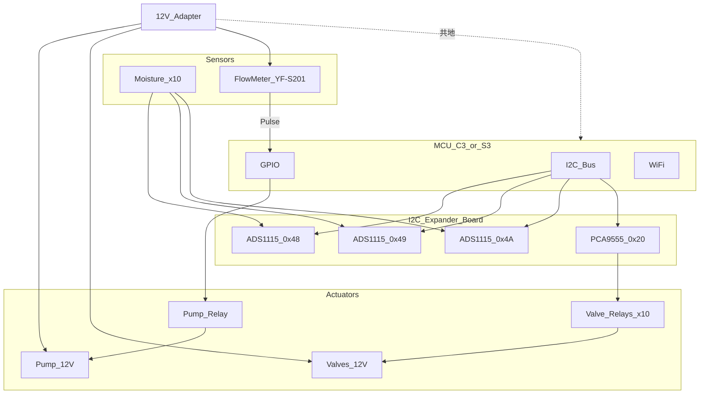
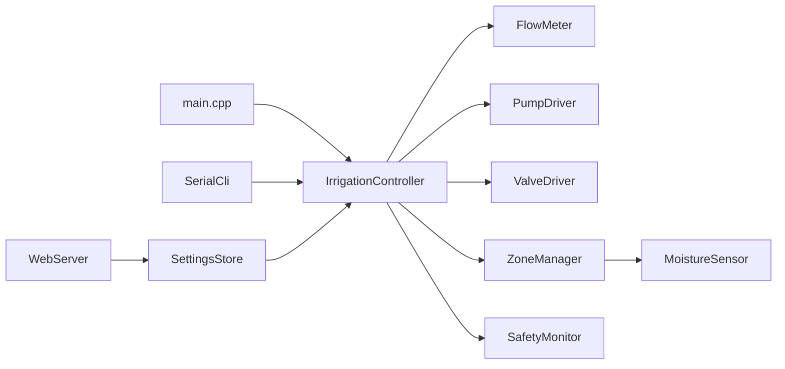
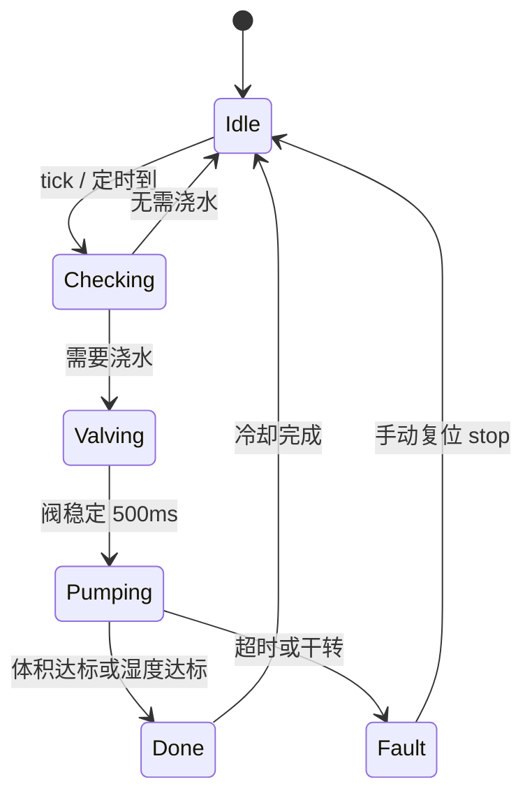

# 系统设计文档 — ESP32 多路自动浇花系统

> 版本：2.1 | 最后更新：2026-08-01

## 1. 项目背景与目标

家用多盆植物需要定时、定量补水。纯湿度阈值控制难以保证每次浇水量一致；加入流量计后可实现 **mL 级定量浇水**，避免过浇或欠浇。

本系统采用 **I2C 扩展子板**（3× ADS1115 + PCA9555），支持 **1–10 个灌溉分区**；前期用 **ESP32-C3 + OLED** 验证，量产 **换 ESP32-S3** 即可（扩展板接线不变）。通过 **WiFi + 本地 Web 界面** 监控与配置，离线亦可独立运行（串口 CLI + RGB LED 状态指示）。

### 1.0.1 硬件平台策略

| 项目 | 约定 |
|------|------|
| **架构** | **I2C 扩展子板**（3× ADS1115 + 1× PCA9555），最多 **10 盆** |
| **前期验证** | ESP32-C3 + OLED（`BOARD_C3_OLED_TEST`，I2C GPIO6/7） |
| **量产** | ESP32-S3（`BOARD_S3_IRRIGATION`，I2C GPIO8/9） |
| **换板策略** | **扩展子板接线不变，只换 MCU 模块** |
| **代码入口** | `include/platform.h` → `board_c3_oled.h` / `board_s3.h` + 共用 `board_io_map.h` |

### 1.0.2 多盆 vs 多 MCU

**一个 MCU 可管理多盆植物**，无需每盆配一块开发板：

- **每盆 1 个湿度探头** → 接 ADS1115（I2C 扩展板）
- **共用 1 个水泵 + 1 个流量计** → 按分区排队顺序灌溉
- **v2.1**：PCA9555 驱动最多 **10 路电磁阀**，固定分水管，全自动多盆

成本对比（2 盆）：

| 方案 | MCU | 湿度探头 | 估算 |
|------|-----|----------|------|
| 本设计 | 1 × C3 | 2 | ~¥25 + 2×¥5 |
| 每盆一 MCU | 2 × C3 | 2 | ~¥50 + 2×¥5 |

固件中 `MAX_ZONES=10`、`ACTIVE_ZONES=2`（见 `include/config.h`），分区数据结构已支持 10 路。

### 1.1 设计目标

| 目标 | 指标 |
|------|------|
| 定量精度 | ±5%（标定后，YF-S201 典型值 450 pulse/L） |
| 分区数 | 初版 2 路，架构支持 10 路（I2C 扩展） |
| 联网 | 局域网 Web UI，WiFi 默认关闭 |
| 安全 | 超时停泵、干转检测、日累计上限 |
| 可维护 | 模块化固件 + 文档与代码映射（见 [DOC_MAP.md](DOC_MAP.md)） |

---

## 2. 需求规格

### 2.1 功能需求

| ID | 功能 | 说明 |
|----|------|------|
| F1 | 土壤湿度采集 | 电容式传感器，ADC 读取，支持干/湿两点校准 |
| F2 | 阈值自动浇水 | 湿度 < 下限时启动，达到上限或目标体积后停止 |
| F3 | 定时定量浇水 | 按 HH:MM 调度，每次固定 mL |
| F4 | 手动浇水 | Web / CLI 指定分区与体积 |
| F5 | 流量计闭环 | 脉冲计数换算体积，达到目标停泵 |
| F6 | 多分区顺序灌溉 | 单泵，同一时刻仅一个分区浇水，其余排队 |
| F7 | Web 监控 | 实时湿度、泵状态、今日流量、配置 |
| F8 | 串口 CLI | 115200 baud，调试与标定 |
| F9 | OTA | 局域网 Web 固件升级（可选密码） |
| F10 | NVS 持久化 | 阈值、体积、WiFi、标定系数掉电保存 |

### 2.2 非功能需求

- **响应**：湿度采样周期 5 s，Web 状态刷新 2 s
- **可靠性**：泵最大单次运行 60 s（可配置）；干转 3 s 无脉冲则锁定
- **扩展**：v3 可增 MQTT / 云端监控

---

## 3. 硬件架构

### 3.1 系统框图



### 3.2 多路灌溉策略（v2.1 — 当前实现）

**单泵 + 每路电磁阀 + 共用流量计 + I2C 扩展**

- 1 × 12 V 水泵 + 1 × 流量计（泵后、阀前）
- 每盆 1 × 湿度探头（ADS1115）+ 1 × 12 V 常闭电磁阀（PCA9555）
- `zone_count` 可设 **1–10**（单盆只用 Zone 0 即可）
- 浇水序列：**开阀 → 等待 500 ms → 开泵 → 定量停泵 → 关阀**
- 同一时刻仅一路阀开启，多盆请求排队执行

```
水源 → [泵] → [直管] → [流量计] → [直管] → 分水器 ─┬─ [阀0] → [止回] → 盆0
                                                  ├─ [阀1] → [止回] → 盆1
                                                  └─ …
```

### 3.2.1 电磁阀选型

| 项目 | 要求 |
|------|------|
| 类型 | **两通 2-way**（一进一出），**非三通 3-way** |
| 常态 | **常闭 NC**（断电关） |
| 电压 | 12 V DC |
| 数量 | 1 盆 = 1 阀 |

### 3.2.2 定量精度与管长差异

**单表测主路总流量**，固件在 `beginPumping()` 时 `flow_->resetSession()`，累计至 `volume_ml` 后停泵。

计数包含：

- 共用段（泵 → 分水器）：各盆相同
- 该盆支管（阀 → 盆）：**随管长变化（死体积）**

| 现象 | 原因 | 对策 |
|------|------|------|
| 长支管盆进土偏少 | 死体积占设定比例大 | **每盆独立 `volume_ml` 标定** |
| 换盆后首段不准 | 管路存气 / 存水 | 排气；阀后 **止回阀** |
| 读数波动 | 表前弯头太近 | 表前后 **15–20 cm 直管** |

**流量计最佳位置**：泵后、分水器前（详见 [wiring.md](wiring.md)）。

未来可选增强：每分区 `volume_offset_ml`、稳定流量后再计数（v2.2+）。

### 3.3 引脚与 I2C 分配

**MCU 直连**（因板型而异，见 `board_c3_oled.h` / `board_s3.h`）：

| 功能 | C3 OLED 测试 | S3 量产 |
|------|--------------|---------|
| I2C SDA / SCL | GPIO6 / GPIO7 | GPIO8 / GPIO9 |
| 水泵继电器 | GPIO3 | GPIO4 |
| 流量计 | GPIO5 | GPIO5 |
| RGB LED | GPIO8 | GPIO48 |

**I2C 扩展板**（两板相同，见 `board_io_map.h`）：

| 器件 | 地址 | 映射 |
|------|------|------|
| ADS1115 ×3 | 0x48 / 0x49 / 0x4A | 10 路湿度 AIN |
| PCA9555 | 0x20 | 阀继电器 P0–P9 |

详细接线见 [wiring.md](wiring.md)，采购清单见 [bom.md](bom.md)。

### 3.4 电源设计

```
12V 适配器 ──→ [水泵 + 流量计 + 电磁阀]
     │
     └── GND ──共地── ESP32 GND

USB 5V ──→ ESP32（开发阶段）
或 12V ──→ [降压模块 5V/1A] ──→ ESP32 + 继电器 VCC（定型部署）
```

- MCU 与泵 **必须共地**
- I2C 扩展板与 MCU 共 3.3 V / GND；长排线建议 SDA/SCL 加 4.7 kΩ 上拉

---

## 4. 软件架构

### 4.1 模块划分



| 模块 | 路径 | 职责 |
|------|------|------|
| I2cBus | `src/bus/i2c_bus.cpp` | Wire 初始化、设备探测 |
| Ads1115 | `src/sensor/ads1115.cpp` | I2C ADC，16 位转 12 位标度 |
| MoistureSensor | `src/sensor/moisture_sensor.cpp` | 分区湿度、校准、百分比 |
| FlowMeter | `src/sensor/flow_meter.cpp` | 脉冲中断、体积换算 |
| Pca9555 | `src/actuator/pca9555.cpp` | I2C IO 扩展，阀继电器位 |
| PumpDriver | `src/actuator/pump_driver.cpp` | 水泵继电器 |
| ValveDriver | `src/actuator/valve_driver.cpp` | 分区电磁阀（互锁，仅一路开） |
| ZoneManager | `src/control/zone_manager.cpp` | 分区配置与湿度状态 |
| IrrigationController | `src/control/irrigation_controller.cpp` | 浇水状态机、队列 |
| SafetyMonitor | `src/safety/safety_monitor.cpp` | 超时、干转、日限额 |
| SettingsStore | `src/storage/settings_store.cpp` | NVS 读写 |
| WebServer | `src/web/web_server.cpp` | REST API + 内嵌页面 |
| SerialCli | `src/cli/serial_cli.cpp` | 串口命令 |

### 4.2 控制状态机



**Valving：** 关闭所有阀 → 打开目标 Zone 阀 → 等待 `DEFAULT_VALVE_SETTLE_MS`（500 ms）

**Pumping 子循环（每 100 ms）：**

1. 读流量计累计体积
2. 若 `volume >= target_ml` → 停泵、关阀 → Done
3. 若 `moisture >= upper_threshold` 且模式含阈值 → 停泵、关阀 → Done
4. 若 `elapsed > max_run_sec` → 停泵 → Fault（TIMEOUT）
5. 若 `pump_on && elapsed > 3s && pulses == 0` → 停泵 → Fault（DRY_RUN）

### 4.3 浇水模式

| 模式 | 触发 | 停止条件 |
|------|------|----------|
| 阈值 | 湿度 < `moisture_low` | 湿度 ≥ `moisture_high` **或** 体积 ≥ `volume_ml` |
| 定时 | 每日 `schedule_hour:minute` | 体积 ≥ `volume_ml` |
| 手动 | Web `POST /api/irrigate` 或 CLI `water` | 体积 ≥ 指定 mL |

模式可 per-zone 组合：`auto_enabled` + `schedule_enabled`。

### 4.4 数据模型

#### ZoneConfig（每分区）

| 字段 | 类型 | 默认 | 说明 |
|------|------|------|------|
| name | string(16) | Zone0 | 显示名 |
| moisture_low | uint8 | 30 | 触发下限（%） |
| moisture_high | uint8 | 60 | 停止上限（%） |
| volume_ml | uint16 | 100 | 单次目标体积 |
| auto_enabled | bool | true | 阈值模式 |
| schedule_enabled | bool | false | 定时模式 |
| schedule_hour | uint8 | 8 | 0–23 |
| schedule_minute | uint8 | 0 | 0–59 |
| cal_dry | uint16 | 3200 | ADC 干土校准 |
| cal_wet | uint16 | 1400 | ADC 湿土校准 |

#### SystemConfig（全局）

| 字段 | 类型 | 默认 | 说明 |
|------|------|------|------|
| max_run_sec | uint16 | 60 | 单次最长泵运行 |
| daily_limit_ml | uint32 | 2000 | 日累计上限 |
| pulses_per_liter | uint16 | 450 | 流量计标定 |
| dry_run_sec | uint8 | 3 | 干转判定时间 |
| zone_count | uint8 | 2 | 激活分区数 |

#### NVS 命名空间

- Namespace: `irrigation`
- Magic: `0x49525247`（"IRRG"）
- Keys: `magic`, `z0_name`, `z0_mLow`, … 详见 [development.md](development.md)

---

## 5. 安全设计

| 保护 | 条件 | 动作 | 恢复 |
|------|------|------|------|
| 最大单次时长 | 泵运行 > max_run_sec | 停泵，状态 TIMEOUT | CLI/Web `stop` 或 `reset` |
| 干转检测 | 泵开 dry_run_sec 内脉冲=0 | 停泵，状态 DRY_RUN，锁定 | 手动 `stop` 解除 |
| 日累计上限 | 今日流量 ≥ daily_limit_ml | 拒绝自动浇水 | 午夜自动清零 |
| 传感器异常 | ADC 超出 0–4095 或校准后 >100% | 跳过该分区自动浇水 | 重新标定 |
| 并发互锁 | 已有分区 Pumping | 请求入队 | 前一任务完成后执行 |
| 急停 | POST /api/emergency-stop | 立即停泵 | 同 stop |

---

## 6. Web API 概要

| 方法 | 路径 | 说明 |
|------|------|------|
| GET | `/api/status` | 全局与各分区状态 |
| GET | `/api/settings` | 读取配置 |
| POST | `/api/settings` | 保存配置（JSON body） |
| POST | `/api/irrigate` | `{"zone":0,"volume_ml":100}` |
| POST | `/api/emergency-stop` | 急停 |
| GET | `/api/wifi` | WiFi 状态 |
| POST | `/api/wifi` | 设置 SSID/密码 |

完整协议见 [development.md](development.md)。

---

## 7. 扩展路线

| 版本 | 内容 |
|------|------|
| v2.0 | 单泵 + 电磁阀多水路、1–4 分区（**当前**） |
| v2.1 | SH1106 OLED 本地显示 |
| v3.0 | MQTT / Home Assistant |
| v3.1 | 湿度历史曲线、LittleFS 日志 |

---

## 8. 参考项目

本固件架构参考 [TempControl](https://github.com/) 项目（同作者本地：`../TempControl`）的 PlatformIO 分层、NVS 设置、Web UI 与串口 CLI 模式。
